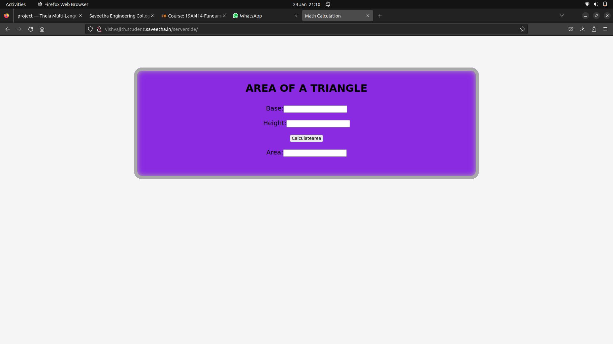

# Design a Website for Server Side Processing

## AIM:
To design a website to perform mathematical calculations in server side.

## DESIGN STEPS:

### Step 1:
Clone the repository from Github


### Step 2:
Create django admin project


### Step 3:
Create a new app


### Step 4:
Create python programs for views and urls


### Step 5:
Create a HTML file of forms


### Step 6:

Publish the website in the given URL.

## PROGRAM :

```
<!DOCTYPE html>
<html>
<head>
    <meta charset='utf-8'>
    <meta http-equiv='X-UA-Compatible' content='IE=edge'>
    <title>Math Calculation</title>
    <meta name='viewport' content='width=device-width, initial-scale=1'>
    
</head>
<style>
    *{
        box-sizing: border-box;
        font-family:'Lucida Sans', 'Lucida Sans Regular', 'Lucida Grande', 'Lucida Sans Unicode', Geneva, Verdana, sans-serif
    }

    body{
    background-color: whitesmoke;
    }

    h1 {
        font-family:'Segoe UI', Tahoma, Geneva, Verdana, sans-serif;
    }

    .container{
    width: 1080px;
    height: 350px;
    margin-top: 100px;
    margin-left: auto;
    margin-right: auto;
    border-radius: 25px;
    border: 10px solid darkgrey;
    box-shadow: inset 0 0 15px darkgrey;
    background-color: blueviolet;
    }
    h1{
        text-align: center;
        padding-top: 15px;
    }
    .calculate{
        padding-top: 10px;
        padding-bottom: 10px;
        padding-left: 10px;
        padding-right:10px;
        text-align: center;
        font-size: 20px;
    }
</style>
<body>
    <div class="container">
        <h1>AREA OF A TRIANGLE</h1>
        <form method="POST">
            
            <div class="calculate"> 
                Base:<input type="text" name="base" value={{b}}></input><br/>
            </div>
            <div class="calculate">
                Height:<input type="text" name="height" value={{h}}></input><br/>
            </div>
            <div class="calculate">
                <input type="submit" value="Calculatearea"></input><br/>
            </div>
            <div class="calculate">
                Area:<input type="text" name="area" value={{area}}></input>
            </div>
        </form>
    </div>
    
</body>
</html>

```

## OUTPUT:




## Result:
The program for implementing server side process is successfull

